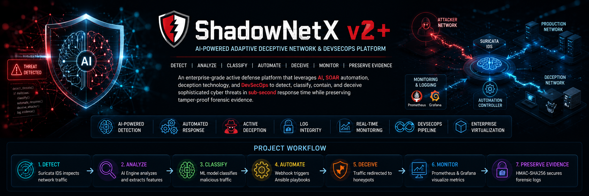

# 🛡️ ShadowNetX v2+

<div align="center">

### AI-Powered Adaptive Deceptive Network & DevSecOps Platform

<p>
An enterprise-grade, closed-loop <strong>Active Defense & Deception Platform</strong> designed to transform modern <strong>Security Operations Centers (SOCs)</strong> from passive alert monitoring into <strong>sub-second automated threat mitigation</strong>.
</p>

<p>
ShadowNetX v2+ integrates <strong>Machine Learning</strong>, <strong>Security Orchestration, Automation and Response (SOAR)</strong>, <strong>Network Deception</strong>, and <strong>DevSecOps</strong> to detect, classify, contain, and deceive sophisticated cyber threats—including <strong>DDoS</strong>, <strong>Port Scans</strong>, and <strong>SSH/FTP Brute Force attacks</strong>—within <strong>1.8 seconds</strong>, while preserving tamper-proof forensic evidence through <strong>HMAC-SHA256 cryptographic watermarking</strong>.
</p>

</div>

---

<div align="center">


</div>

---

> **ShadowNetX v2+** is an AI-powered DevSecOps platform that combines Machine Learning, SOAR automation, network deception, and continuous observability to detect, contain, and investigate cyber threats in real time.

## 🔄 Threat Lifecycle

The following workflow summarizes the end-to-end lifecycle of an attack within **ShadowNetX v2+**.

```text
Detect
   │
   ▼
Analyze
   │
   ▼
Classify
   │
   ▼
Automate
   │
   ▼
Contain
   │
   ▼
Deceive
   │
   ▼
Monitor
   │
   ▼
Preserve Evidence
```
---

# 🚀 Key Features

| Feature | Description |
|---------|-------------|
| ⚡ AI Threat Detection | Random Forest classifier performs real-time malicious traffic classification. |
| 🛡️ Automated Response | SOAR-driven Ansible playbooks automatically isolate malicious hosts. |
| 🍯 Active Deception | Transparent attacker redirection to Cowrie and Dionaea honeypots. |
| 🔐 Log Integrity | HMAC-SHA256 cryptographic signing guarantees forensic integrity. |
| 📊 SOC Monitoring | Prometheus and Grafana provide real-time operational visibility. |
| 🔄 DevSecOps Pipeline | GitHub Actions automate testing, validation, and deployment. |
| 🖥️ Enterprise Virtualization | Complete enterprise deployment implemented inside EVE-NG. |

---

# 📑 Table of Contents

- [System Architecture](#system-architecture)
- [Native Network Topology](#native-network-topology)
- [Active Mitigation Sequence](#active-mitigation-sequence)
- [SOC Monitoring Dashboard](#soc-monitoring-dashboard)
- [Core Architecture](#core-architecture)
- [Performance Evaluation](#performance-evaluation)
- [KPI Comparison](#kpi-comparison)
- [Quick Start](#quick-start)
- [Engineering Team](#engineering-team)
- [Technology Stack](#technology-stack)
- [Repository Structure](#repository-structure)
- [Future Enhancements](#future-enhancements)
- [Academic Information](#academic-information)
- [Acknowledgments](#acknowledgments)

---

# System Architecture

The following diagram illustrates the logical architecture of **ShadowNetX v2+**, highlighting the interaction between the AI detection engine, asynchronous automation pipeline, deception layer, observability stack, and forensic protection components.

<p align="center">

</p>

---

# Native Network Topology

The following topology represents the actual enterprise laboratory deployed inside **EVE-NG**, including the attacker segment, Suricata gateway, production network, deception subnet, monitoring server, and automation controller.

<p align="center">

</p>

---

# Active Mitigation Sequence

The following sequence diagram illustrates the complete mitigation lifecycle—from initial packet inspection to automated threat isolation, transparent deception, and cryptographic forensic logging.

<p align="center">

</p>

> The three diagrams above provide complementary perspectives of the platform:
>
> - **System Architecture** describes the logical interaction among platform components.
> - **Native Network Topology** presents the real deployment environment implemented in EVE-NG.
> - **Active Mitigation Sequence** demonstrates the end-to-end automated response workflow.

---

# SOC Monitoring Dashboard

The dashboard provides real-time visibility into AI detections, attack intensity, and overall platform health through Prometheus and Grafana.

<p align="center">
  
</p>

The dashboard displays:

- Real-time Attack Intensity
- AI Detection Timeline
- Benign vs. Malicious Traffic Statistics
- Prometheus metrics exported by the AI Log Exporter
  ---
  
# Core Architecture

ShadowNetX v2+ follows a modular architecture composed of six tightly integrated layers that collectively provide intelligent detection, automated response, active deception, continuous monitoring, and forensic integrity.

---
## 1️⃣ AI Threat Detection Engine

The AI Detection Engine continuously monitors network events generated by **Suricata IDS**, extracts flow-based features, and performs real-time malicious traffic classification using a trained **Random Forest** model.

### Real-Time Log Collection

- Continuously tails **Suricata `eve.json`**
- Parses IDS events in real time
- Converts raw logs into structured feature vectors

### Feature Engineering

```text
Feature Vector = {
    src_port,
    dest_port,
    pkts_toserver,
    pkts_toclient,
    bytes_toserver,
    bytes_toclient,
    flow_duration,
    protocol
}
```

### Machine Learning

| Property | Value |
|----------|-------|
| Model | Random Forest Classifier |
| Detection Accuracy | **98.2%** |
| Average Inference Time | **≈ 50 ms** |

---

## 2️⃣ Security Orchestration, Automation and Response (SOAR)

ShadowNetX decouples threat detection from mitigation using an asynchronous automation pipeline, ensuring that response execution never delays packet inspection.

### Flask Webhook API

The multi-threaded Flask API acts as a lightweight orchestration bridge between the AI detection engine and the automation layer.

**Responsibilities**

- Receives AI alerts
- Validates attack payloads
- Launches asynchronous mitigation threads
- Returns an immediate HTTP 200 response

### Automated Ansible Response

The automation layer executes agentless playbooks over SSH to dynamically update Linux Netfilter rules.

Typical actions include:

- Deploying DNAT redirection rules
- Blocking malicious IP addresses
- Updating gateway firewall policies
- Triggering deception workflows

> **Mean Time to Respond (MTTR): < 1.8 Seconds**

---

## 3️⃣ Active Deception Layer

Instead of immediately dropping malicious traffic, ShadowNetX transparently redirects attackers into isolated deception environments for behavioral analysis.

### Deception Components

| Component | Purpose |
|-----------|---------|
| Cowrie | SSH Honeypot |
| Dionaea | FTP / HTTP Honeypot |

### Traffic Redirection

Dynamic **iptables DNAT** rules transparently redirect malicious sessions without alerting the attacker, enabling realistic interaction inside controlled environments.

---

## 4️⃣ Cryptographic Forensic Protection

Every attacker interaction captured inside the honeypot environment is digitally signed before storage.

```text
Signature =
HMAC-SHA256(
    SecretKey,
    dumps(Log, sort_keys=True)
)
```

This mechanism guarantees:

- Log authenticity
- Tamper detection
- Forensic integrity
- Non-repudiation

Any modification to the stored evidence immediately invalidates the generated signature.

---

## 5️⃣ Continuous Observability

ShadowNetX exports operational metrics to the monitoring stack, enabling real-time SOC visibility.

### Monitoring Stack

| Component | Function |
|-----------|----------|
| Prometheus | Metrics Collection |
| Grafana | Dashboard Visualization |

Metrics are collected every **5 seconds**, including:

- Attack Intensity
- Active Mitigations
- AI Detection Rate
- Honeypot Sessions
- Log Integrity Status

---

## 6️⃣ DevSecOps Pipeline

The deployment pipeline automatically validates infrastructure and application changes before production deployment.

### GitHub Actions Workflow

The pipeline performs:

- Python Syntax Validation
- Flake8 Code Quality Checks
- Bandit Security Scanning
- Gitleaks Secret Detection
- Automated Infrastructure Deployment

This ensures every deployment is reproducible, secure, and continuously validated.

---

# Performance Evaluation

## Mean Time to Mitigate (MTTM)

| Metric | Value |
|---------|------:|
| Manual SOC Response | ≈ 300 s |
| ShadowNetX Response | **< 1.8 s** |
| Improvement | **99.4% Faster** |

---

## Detection Performance

| Metric | Value |
|---------|------:|
| Detection Accuracy | **98.2%** |
| Average Inference Time | **≈ 50 ms** |
| Detection Latency | Near Zero |

The asynchronous architecture ensures mitigation execution has negligible impact on real-time packet inspection.

---

# KPI Comparison

| Metric | Traditional SOC | ShadowNetX v2+ |
|---------|-----------------|----------------|
| Response Time | ~300 s | <1.8 s |
| Detection Method | Signature-based | AI (Random Forest) |
| Detection Accuracy | N/A | 98.2% |
| Monitoring Interval | 60 s | 5 s |
| Log Integrity | Plain Text | HMAC-SHA256 |
| Gateway Deployment | Agent Required | Agentless SSH |

---
# Quick Start

## Prerequisites

Before deployment, ensure the following components are installed and configured:

- Ubuntu 22.04 LTS (or later)
- Python 3.10+
- Docker & Docker Compose
- Ansible
- Git
- SSH Connectivity
- Suricata IDS
- Prometheus & Grafana

---

## 1. Start the AI Log Exporter

The AI Log Exporter continuously monitors Suricata's `eve.json`, extracts flow features, performs Machine Learning inference, and exports metrics to Prometheus.

```bash
python3 log_exporter.py \
    --path /var/log/suricata/eve.json
```

---

## 2. Start the Flask Webhook API

The webhook receives alerts from the AI Detection Engine and asynchronously triggers the automation pipeline.

```bash
export FLASK_APP=webhook_listener.py

flask run \
    --host=0.0.0.0 \
    --port=5000
```

---

## 3. Deploy the Infrastructure

Deploy monitoring, deception services, and automation components.

```bash
ansible-playbook \
    -i inventory.ini \
    site.yml
```

---

# Engineering Team

| Member | Responsibilities |
|---------|------------------|
| **Ahmed Ibrahim Adawy Mohamed** | **DevOps, Infrastructure & Automation Lead** — Designed and implemented the enterprise EVE-NG topology, developed the complete Ansible automation framework, built the AI Log Exporter for integrating the Machine Learning model with the automation pipeline, implemented the multi-threaded Flask Webhook API, deployed and configured the Prometheus & Grafana monitoring stack, and co-developed the GitHub Actions CI/CD pipeline. |
| **Nagy** | Designed, trained, and evaluated the Random Forest Machine Learning model, including feature engineering, dataset preparation, and real-time inference logic. |
| **Sara Ashraf** | Designed the enterprise network topology and contributed to the HMAC-SHA256 forensic watermarking implementation. |
| **Asmaa Ibrahim** | Implemented the HMAC-SHA256 watermarking engine, developed the forensic verification module, and contributed to the Suricata IDS integration. |
| **Omar** | Developed the GitHub Actions CI/CD workflows, automated security scanning (Bandit, Flake8, Gitleaks), and deployment automation. |

---

# Technology Stack 

| Category | Technologies |
|----------|--------------|
| Programming | Python, Bash |
| Machine Learning | Scikit-learn, Pandas, NumPy |
| IDS | Suricata |
| Automation | Ansible |
| Monitoring | Prometheus, Grafana |
| Deception | Cowrie, Dionaea |
| Containerization | Docker |
| CI/CD | GitHub Actions |
| Virtualization | EVE-NG |
| Operating System | Ubuntu Linux |

---

# Repository Structure

```text
ShadowNetX/
│
├── ansible/
│   ├── playbooks/
│   ├── inventory.ini
│   └── roles/
│
├── ai/
│   ├── model.pkl
│   ├── feature_engineering.py
│   └── log_exporter.py
│
├── webhook/
│   └── webhook_listener.py
│
├── monitoring/
│   ├── prometheus.yml
│   └── grafana/
│
├── honeypots/
│   ├── cowrie/
│   └── dionaea/
│
├── docs/
│
└── README.md
```

---

# Future Enhancements

The platform can be extended with additional enterprise-grade capabilities, including:

- Kubernetes-native deployment
- Multi-node automation controllers
- SIEM integration (Splunk / ELK)
- Threat intelligence feeds
- Deep Learning-based anomaly detection
- Automatic rollback and recovery
- Multi-cloud deployment support (AWS, Azure, GCP)

---

# Academic Information

**Graduation Project**

Faculty of Engineering

Department of Electronics & Communications Engineering

Academic Year **2025–2026**

**Project Evaluation:** **Excellent**

---

# Acknowledgments

We would like to express our sincere appreciation to the Faculty of Engineering, our academic supervisors, and everyone who contributed to the successful completion of this graduation project.

---

<div align="center">

### ⭐ If you found this project interesting, don't forget to leave a Star!

**ShadowNetX v2+**

*AI-Powered Adaptive Deceptive Network & DevSecOps Platform*

</div>
